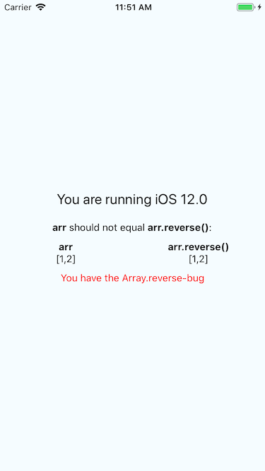
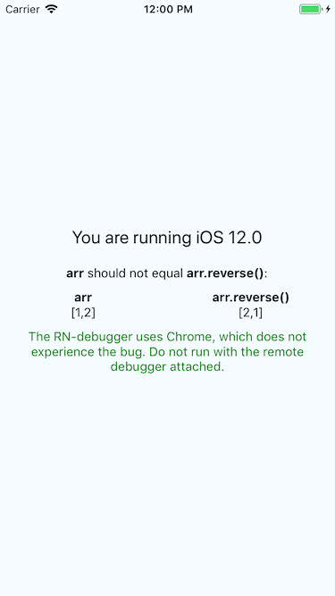

# React Native Array.reverse bug

This is an example app to demonstrate that the `Array.reverse` bug for iOS 12 exists in React Native as well.

Some have called to calling this a "Safari bug", but that is misleading. The bug exists in the `JavascriptCore`-framework for iOS, which several other apps/frameworks depend upon, React Native among them.

Buggy-check code borrowed from the [array-reverse-polyfill](https://github.com/fanmingfei/array-reverse-ios12/blob/0c54a037a30113fa4027a0972c58fdd90fac4747/index.js#L3)-package:

```javascript
var a = [1, 2];
return String(a) === String(a.reverse());
```

# Screenshots

If your device/simulator is running iOS 12, the following should be displayed:



**Important**! If the React Native remote debugger is attached, the bug will not occur.

This is because the remote debugger uses Chrome, instead of `JavascriptCore`:



# Links

- https://news.ycombinator.com/item?id=18021835
- https://stackoverflow.com/a/52394459/5703116
- https://bugs.webkit.org/show_bug.cgi?id=188794
- https://www.npmjs.com/package/array-reverse-polyfill
